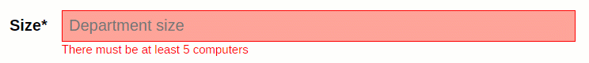

# Introduction
AB-APP is an AWS serverless boilerplate application. You can use it as a starting point for your own applications. AB-APP is using [bit](https://bitsrc.io), so you can not only use it as a whole but also make use of some parts of it.

AB-APP is a site of fictional "Scientific Research Institute of Sorcery and Wizardry" from the famous novel by Boris and Arkady Strugatsky "[Monday Begins on Saturday](https://en.wikipedia.org/wiki/Monday_Begins_on_Saturday)". AB-APP exposes the list of institute departments for authenticated users. It also allows to add and edit departments.

AB-APP is deployed here: [d1v3l4fe3mshyi.cloudfront.net](http://d1v3l4fe3mshyi.cloudfront.net). It might not be the last version as we don't redeploy every time we push changes in the repo. Also, note that when visiting the link for the first time application may fail due to AWS Lambda cold start. Just be patient and reload the page several times.

## Current status
AB-APP is still under development. **It is not finished**! Feel free to experiment with it, but don't use it in production as is.

## Architecture


The application uses RDS/DynamoDB and S3 for persistent storage. A single lambda function holds all the backend logic. API Gateway (for now) is used as a proxy service to pass requests from the frontend to the backend. CloudFront CDN allows delivering the application's content fast.

The application has two main folders: **backend** and **frontend**. Backend folder contains backend code and frontend folder contains static content (frontend code, assets, etc.) 

AB-APP backend is written in Node.js. AB-APP frontend is written with React, Redux, and Redux-Saga.

## Features implemented
Authentication using **JWT tokens** + tokens refresh.

**Tables** for viewing data with pagination, row selection, sorting and CSV export.

**Forms** for adding and editing data with live, backend-frontend consistent validation.

## TODO
- Replace API Gateway with AppSync. AppSync provides a convenient way of communication between frontend and backend using GraphQL queries and is also responsible for offline and real-time functionality.
- Add DynamoDB support
- Add real-time features
- Add PWA features and offline functionality

# Table of contents
- [Installation for local development](https://github.com/gnemtsov/ab-app#installation)
- [Starting AB-APP locally](https://github.com/gnemtsov/ab-app#starting-ab-app-locally)
- JWT authentication
- [Tables](https://github.com/gnemtsov/ab-app#tables)
    - [Architecture](https://github.com/gnemtsov/ab-app#architecture-1)
    - [Formatters functions](https://github.com/gnemtsov/ab-app#formatters-functions)
    - [Core table component](https://github.com/gnemtsov/ab-app#core-table-component)
- [Forms](https://github.com/gnemtsov/ab-app#forms)
    - [Architecture](https://github.com/gnemtsov/ab-app#architecture-2)
    - [Validation](https://github.com/gnemtsov/ab-app#validation)
    - [Core form component](https://github.com/gnemtsov/ab-app#core-form-component)
- PWA and offline
- Real-time
- Testing
- Deploying
- Bit
- [How to contribute](https://github.com/gnemtsov/ab-app#how-to-contribute)


# Installation
1. Install a database (MariaDB), Node.js, NPM, docker, [aws-sam-cli](https://github.com/awslabs/aws-sam-cli) and [Redux DevTools extension](https://github.com/zalmoxisus/redux-devtools-extension)
2. Git clone or download the project source
3. Run `npm install` in the root folder, the frontend, and the backend folders
4. Import mysql.dump.sql in your MariaDB instance
5. Create the file `backend/.env` with the following content (replace DB_HOST with IP of your local DB instance):
```
#Environment
PROD=false

#Token secret
SECRET="SOME_SECRET_CODE_672967256"

#DB
DB_HOST="192.168.1.5"
DB_NAME="abapp"
DB_USER="abapp"
DB_PASSWORD="abapp"
```
6. Create a user **abapp** with password **abapp** in your mysql.user table and give appropriate rights to allow the lambda function to connect and work with your database

# Starting AB-APP locally
1. Run docker and then run `sam local start-api` to start local API Gateway (set --docker-volume-basedir parameter to your .../backend dir, if you use remote docker)
2. Run `npm start` in the frontend folder to start webpack development server
3. Have fun! :smiley:


# Tables

Tables are the best way to present data to the users of your application. AB-APP table implementation includes backend and frontend logic. 

Implemented features:
- Pagination
- Sorting (hold shift for multisort) 
- Row selection (hold ctrl or shift to select multiple rows)
- CSV data export
- Sticky table toolbar
- Easy custom styling
- Very fast and lightweight, no dependencies

## Architecture

On the backend, there is a corresponding .sql file for each application table. This file contains a query that is executed to fetch table data from a database. Column descriptions are also stored on the backend. They are stored as .json files as array of objects. These descriptions go to `cols` property of the table React component (see below).

The backend is responsible for fetching table data from a database, applying backend "formatters" (see below) and providing column descriptions. 

The frontend is responsible for rendering tables. It has two React components: a high order table component (HOC) and a core table component. The core table component can be used outside AB-APP as an independent React component. 

HOC is responsible for fetching table data from the backend and applying frontend formatters. The core component is responsible for rendering and providing main table functionality (selecting, sorting, pagination, etc.)


## Formatters functions
Formatter function is a function that accepts column description and raw table data of the current row and returns the rendered content of table cell. There are backend and frontend libs of formatters functions.

Example:
```jsx
const sampleFormatter = (col, row) => `<b>${row.lastname}${row.firstname}</b>`;
```

Formatters are defined for a column and they are executed for each table cell in a column. There can only be one formatter per column. 

Since formatter function is executed for each cell, it slows down table creation and/or rendering. If possible you should try not to use formatters at all - try to get table data as it should be displayed right from a database. 

If you need to use a formatter, try to use frontend formatter. It is executed on the frontend and only for whose column cells that are currently rendered on a page.

Use backend formatters only if there are no other options. Backend formatters are executed on the backend and for all column cells at once.

## Core table component

This component can be used in any application without conjunction with the AB-APP backend.

The component has the following properties:

| Property | Type | Default value | Description |
| --- | --- | --- | --- |
| rowsPerPage | Integer | 10 | Number of rows rendered per page |
| selectable | Boolean | false | Whether rows can be selected or not |
| className | String | '' | Name of a custom CSS class (see below) |
| csvExport | Boolean | true | Whether table can be exported as CSV-file |
| emptyTableMessage | String | 'No data specified' | A message, shown when the table is empty. |
| cols | Array of objects | [] | Columns descriptions (see below) |
| rows | Array of objects | [] | Table data (see below) |


### Custom styling (className property)

To apply custom styling you should define `className` property. Your class will be put on top of default table styles, so all your custom styles will override the default. 

For example, to make headers' text green, you should set your custom class: `className = "CustomTable"`. Then write the following CSS in the .css file of your component, where you use table component:
```css
.CustomTable th {
    color: green;
}
```

### Columns descriptions (cols property)

Each table column is an object with the following properties:

| Key | Type | Default | Description |
| --- | --- | --- | --- |
| name | String | - | Column name, must have corresponding data in rows objects (see below). |
| title | String | '' | Column title |
| sortOrder | Integer | 0 | Default column sort priority |
| sortDirection | String | 'ASC' | Default column sort direction (ASC or DESC) |
| html | Boolean | false | Whether the cell content should be put to page as html |


The following properties are available only when using tables as part of AB-APP:

| Key | Type | Default | Description |
| --- | --- | --- | --- |
| frontendFormatter | String | '' | Name of the frontend formatter function |
| backendFormatter | String | '' | Name of the backend formatter function |

### Table data (rows property)

Each table row is an object that holds the data of the table row. Object keys must be the same as the **names** properties of the cols objects.

For example
```jsx
[{ 
    name: 'Buddy', 
    class: 'Dog', 
    age: 3, 
    gender: 'male' 
},
{ 
    name: 'Molly', 
    class: 'Cat', 
    age: 5, 
    gender: 'female' 
}]
```

### Using component independently
```jsx
import React, { Component } from 'react';

import Table from 'table';

export default class App extends Component {
    render() {
        const cols = [
            { name: 'name', title: 'Pet name' },
            { name: 'class', title: 'Animal class' },
            { name: 'age', title: 'Age' },
            { name: 'gender', title: 'Gender' }
        ]

        const rows = [
            { name: 'Buddy', class: 'Dog', age: 3, gender: 'male' },
            { name: 'Molly', class: 'Cat', age: 5, gender: 'female' },
            { name: 'Bonnie', class: 'Cat', age: 2, gender: 'female' },
            { name: 'Coco', class: 'Parrot', age: 22, gender: 'male' },
            { name: 'Oscar', class: 'Dog', age: 5, gender: 'male' },
            { name: 'Max', class: 'Turtle', age: 15, gender: 'male' },
            { name: 'Jack', class: 'Varan', age: 1, gender: 'male' }
        ]

        return (
            <div
                className="TableContainer" >
                <Table
                    selectable={true}
                    emptyTableMessage={'No animals found'}
                    cols={cols}
                    rows={rows} />
            </div>
        )
    }
}
```

# Forms

Writing forms markup, programming fields validation (both frontend and backend) can be hard! AB-APP makes the whole process a breeze. You just provide form data as a simple json config and that's it! :tada:

Implemented features:
- Live validation as user types
- Consistent frontend-backend validation
- Automatic validation according to DB column types
- Clean, responsible mobile-first CSS markup (horizontal or inline)
- Easy custom styling
- Very fast and lightweight, no dependencies

## Architecture

Architecture is similar to the table architecture. The frontend "knows" only the form's endpoint. It uses a GET request to get the form's configuration, data and validation functions. It uses a POST request to send user data to the backend.

On the backend, there is a corresponding .json file for each form. This file holds fields descriptions. On the frontend, this data goes into fields property of the table component. There is also a .sql file for some forms which holds the query for fetching data for the form fields from a database.

The backend is responsible for building form config and sending it to the frontend. It is also responsible for accepting POST requests, validating data and putting it into the database. 

The frontend has two React components: a high order component (HOC) and a core form component. 

HOC is responsible for fetching form data from the backend and sending user data back - submission of the form. The core component is responsible for rendering and validation.


## Validation

Validation is a very important feature because user experience depends on it a lot.

AB-APP implements realtime validation as user types:


There is a library of validation functions on the backend. When you configure form fields in the .json file you may put an array of validators functions names which you want to use with this field. 

Some validators will be added in the fields configs automatically by fetching and parsing the corresponding column types from the database.

All validators functions bodies are stored on the backend and they are passed to the frontend as strings. On the frontend, these functions are recreated using `new Function()` constructor which allows to create functions dynamically.

Validator function accepts field value as the first parameter and then zero or multiple additional parameters to perform validation. It returns true or false, which means whether validation is passed or not.

For example, this validator checks that a string length is not less than **min** and not more than **max**.
```jsx
module.exports.strMinMax = (value, min, max) => value.length >= min && value.length <= max;
```

As user types in a field's value it is passed to all field's validators one by one. If none of the validators return false field is considered valid. If one of the validators returns false (first wins) field gets invalidated and the validator's message is shown on the page. The message, as well as additional validator parameters, are stored along with validator function body in the object with validator description (see the description of fields property of the React component).

This logic allows writing validators functions in one place - on the backend, making it the single source of truth. It also allows to apply same validators on the frontend as user types and then on the backend when it receives submitted form. We need to validate data on the backend because we should never trust any data, which is coming from the frontend.

## Core form component

This component can be used in any application without conjunction with the AB-APP backend.

The component has the following properties:


| Property | Type | Default value | Description |
| --- | --- | --- | --- |
| layout | String ('horizontal' or 'inline') | 'horizontal' | Form layout type |
| infoIcon | HTML or JSX | feather info icon | Here you can put your custom "i" icon - it can be a react component |
| buttonText | String or Array of strings | ["Submit", "Sending..."] | Text for the submit button. If an array is given it must contain two elements: one for default state and one for sending state |
| doneText | String | 'Done!' | Text that appears near the submit button if the form was submitted successfully |
| doneTextDuration | Integer | 2000 | Number of milliseconds to display doneText near the submit button |
| className | String | '' | Name of a custom class (see below) |
| submitHandler | Function | null | Function that will be invoked when the form is submitted |
| fields | Array of objects | [] | Form fields (see below) |


### Styling

Forms can be rendered as horizontal (default, CSS grid is used) or inline (layout="inline" prop must be set, CSS flex is used). Styles of the form can be overridden by custom className.

You can put a custom class on top of default form styles, so all custom styles will override the default. For example, to make labels green, you should set your custom class: `className = "CustomForm"`. Then write the following CSS in the .css file of your component, where you use react-ab-form:
```css
.CustomForm .Label {
    color: green;
}
```

### Submitting form
Use **submitHandler** property to set a function that will be invoked when the form is submitted. Values of the form will be passed to this function as a parameter. This function must return a promise. 

If the promise resolves `doneText` is shown near the submit button. 

If the promise rejects (it can happen when the server invalidates a field, for example), the error will be caught by the form component. It expects to receive the error in the following format:
```
{
    response: {
            data: {
                field: {
                    name: 'field_name_here',
                    message: 'error_message_here'
                }
            }
        }
}
```

If the form component receives error it shows error message the same way it does when a form field is invalidated on the frontend.

### Form fields

Each form field is an object with the following properties.

| Property | Type | Default value | Description |
| --- | --- | --- | --- |
| name | String | none | Field name |
| label | String | '' | Field label |
| placeholder | String | '' | Field placeholder |
| value | String | none | Field value |
| required | Boolean | false | Whether field is required |
| type | Boolean | false | Field type (see below) |
| allowedValues | Array of strings | [] | Contains allowed values for the field (see "type" property description for more details) |
| noEcho | Boolean | false | If set `true`, value of the field is obscured |
| description | String | '' | String with additional field description. If set, small "i" icon appears near the field. When user hovers the icon this description appears as tooltip |
| validators | Array of objects | '' | Contains validators functions descriptions (one or multiple), see below |

#### Field types
Fields can be one of the following types:

| Field type  | Additional conditions | Renders as |
| ------------- | ------------- | ------------- |
| String  | -  | input type="text" |
| String  | noEcho = true  | input type="password" |
| String  | allowedValues is an array of 2 elements  | input type="radio" |
| String  | allowedValues is an array of more than 2 elements  | select |
| Text  | -  | textarea |
| Number  | -  | input type="text" |
| Boolean  | -  | input type="checkbox" |


#### Field validators
Each validator is described by a separate object with the following properties:
- **params**, (array): additional params values, passed to validator besides field value
- **message** (string): message that should be shown when the validator returns false
- **f** (function or function body as a string): validator function, it should return true or false

When a user changes a field all validators are executed one by one with the current value of the field. If the validator returns `false`, execution stops and current validator message is shown - the field is considered invalid.

### Using component independently
In this code, we use [axios](https://github.com/axios/axios) to send a post request. 

```jsx
import React, { Component } from 'react';
import axios from 'axios';

import FormComponent from 'Form';

export default class App extends Component {
    render() {
        const conf = {
            submitHandler: values => {
                console.log('Form values should be sent to the server here.');
                console.log('submitHandler must return promise.');
                return axios.post('api_endpoint_here', values)
                            .then(response => /*do something*/);
             }
        }

        const fields = [
            {
                name: 'name',
                label: 'Pet name',
                type: 'String',
                required: true,
                validators: [
                    {
                        params: [4, 64],
                        message: 'Must be bigger than 4 and smaller than 64 chars',
                        f: (value, minLength, maxLength) => value.length >= minLength && value.length <= maxLength
                    },
                    {
                        message: 'Can\'t contain digits',
                        f: value => !/[1-9]/.test(value)
                    },
                ]
            }
        ]

        return <FormComponent {...conf} fields={fields} />;
    }
}
```

## How to contribute
1. Click the "Fork" button.
2. Clone your fork to your local machine:
```shell
git clone https://github.com/YOUR_USERNAME/ab-app.git
```
3. Add 'upstream' repo to keep your form up to date:
```shell
git remote add upstream https://github.com/gnemtsov/ab-app.git
```
4. Fetch latest upstream changes:
```shell
git fetch upstream
```
5. Checkout your master branch and merge the upstream repo's master branch:
```shell
git checkout master
git merge upstream/master
```
6. Create a new branch and start working on it:
```shell
git checkout -b NEW_FEATURE
```
7. Push your changes to GitHub.
8. Go to your fork's GitHub page and click the pull request button.

### Further reading
* [How to contribute to a project on Github](https://gist.github.com/MarcDiethelm/7303312)
* [GitHub Standard Fork & Pull Request Workflow](https://gist.github.com/Chaser324/ce0505fbed06b947d962)
* [Fork A Repo - User Documentation](https://help.github.com/articles/fork-a-repo/)
* [Development workflow with Git: Fork, Branching, Commits, and Pull Request](https://github.com/sevntu-checkstyle/sevntu.checkstyle/wiki/Development-workflow-with-Git:-Fork,-Branching,-Commits,-and-Pull-Request)

