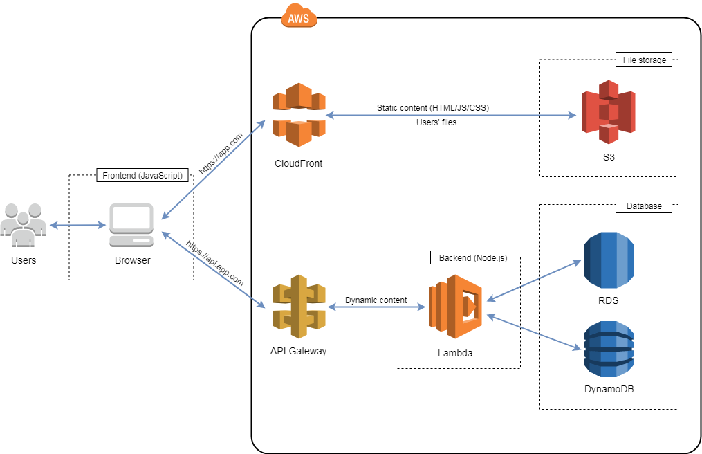

# AB-ERP
AWS serverless app blueprint.
This is a simple, but powerfull approach to create serverless applications in AWS. Your can use AB-ERP as a starting point for creating your own applications.

AB-ERP architecture

App has two main folders: **lambda** and **public**. Lambda folder contains backend code and public contains static content (frontend code).

## Installation
1. Install database (MariaDB)
2. Install Node.js
3. Install NPM
4. Install docker
5. Install [sam-local](https://github.com/awslabs/aws-sam-local)
6. Create project folder and git clone project source 
7. Import mysql.dump.sql in your MariaDB instance
8. Run `npm install` both in project root folder and in lambda folder
9. Run `sam local start-api` to start local API Gateway (set --docker-volume-basedir parameter, if you use remote docker)
10. Run `node abserver.js` from the project root folder to start small express http-server for SPA
11. Have fun! :smiley:
