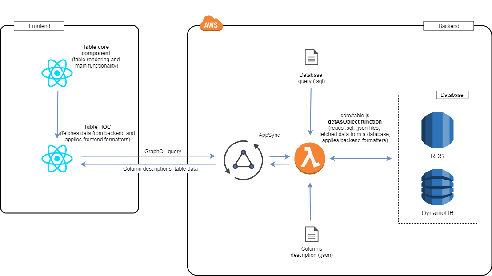

# Introduction
AB-APP is a AWS serverless boilerplate application.
This is a simple, but powerfull approach to create serverless applications in AWS. Your can use AB-APP as a starting point for creating your own applications.

AB-APP is using [bit](https://bitsrc.io), so you can not only use it as a starting point as a whole, but also make use of some parts of AB-APP in your applications.

AB-APP is a site of fictional "Scientific Research Institute of Sorcery and Wizardry" from the famous novel by Boris and Arkady Strugatsky "Monday Begins on Saturday". AB-APP exposes the list of institute departments for authenticated users. It also allows to add and edit departments.

## Architecture

This is a little simplified architecture of the application.


App has two main folders: **backend** and **frontend**. Backend folder contains backend code and frontend folder contains static content (frontend code, assets, etc.) AB-APP backend is written in Node.js. AB-APP frontend is written with React, Redux and Redux-Saga.

## Features implemented
1. **JWT authentication** with tokens refresh
2. **Tables** with pagination, row selection, sorting and csv export
3. **Forms** with live, backend-frontend consistent validation


# Table of contents
- [Installation](https://github.com/gnemtsov/ab-app#installation)
- [JWT authentication](https://github.com/gnemtsov/ab-app#installation)
- [Tables](https://github.com/gnemtsov/ab-app#tables)
    - [Architecture](https://github.com/gnemtsov/ab-app#architecture)
    - [Formatters functions](https://github.com/gnemtsov/ab-app#formatter-functions)
    - [Table React component](https://github.com/gnemtsov/ab-app#table-react-component)
- [Forms](https://github.com/gnemtsov/ab-app#installation)
    - [Architecture](https://github.com/gnemtsov/ab-app#installation)
    - [Installation](https://github.com/gnemtsov/ab-app#installation)
    - [Usage](https://github.com/gnemtsov/ab-app#installation)
    - [Component properties](https://github.com/gnemtsov/ab-app#installation)
- [PWA](https://github.com/gnemtsov/ab-app#installation)
- [Testing](https://github.com/gnemtsov/ab-app#installation)
- [Deploying](https://github.com/gnemtsov/ab-app#installation)
- [Bit](https://github.com/gnemtsov/ab-app#installation)
- [Contributing](https://github.com/gnemtsov/ab-app#installation)


# Installation
1. Install database (MariaDB), Node.js, NPM, docker, [sam-local](https://github.com/awslabs/aws-sam-local) and [Redux DevTools extension](https://github.com/zalmoxisus/redux-devtools-extension)
2. Git clone or download project source
3. Run `npm install` both in frontend and backend folders
4. Import mysql.dump.sql in your MariaDB instance
5. Create file `backend/.env` with the following content (replace DB_HOST with IP of your local DB instance):
```
#Environment
PROD=false

#Token secret
SECRET="SOME_SECRET_CODE_672967256"

#DB
DB_HOST="192.168.1.5"
DB_NAME="abapp"
DB_USER="abapp"
DB_PASSWORD="abapp"

#API
API_PATH="api"
FORMS_PATH="forms"
TABLES_PATH="tables"
MODELS_PATH="models"

```
6. Create user **abapp** with password **abapp** in your mysql.user table and give appropriate rights to allow lambda backend to connect and work with your DB

## Starting AB-APP locally
1. Run docker and then run `sam local start-api` to start local API Gateway (set --docker-volume-basedir parameter to your .../backend dir, if you use remote docker)
2. Run `npm start` in frontend folder to start webpack development server
3. Have fun! :smiley:


# Tables

Table implementation includes backend and frontend functionality. 

Tables have the following features:
- Pagination
- Sorting (hold shift for multisort) 
- Row selection (hold ctrl or shift to select multiple rows)
- CSV data export
- Sticky toolbar
- Easy custom styling
- Very fast and lightweight
- No devependencies

## Architecture

The frontend "knows" only the table name. Everything else is fetched from the backend.

On the backend there is corresponding .sql file for each application table. This file contains query that must be executed to fetch table data from a database. Column descriptions are stored as .json files.

The backend is responsible for fetching table data from a database, applying backend formatters (see below) and providing column descriptions. 

Frontend has two React components. Table high order component and table core component. 

Table HOC is responsible for fetching table data from the backend and applying frontend formatters. Table core component is responsible for rendering and providing main table functionality (selecting, sorting, pagination, etc.)



## Formatters functions
There are backend and frontend libs of formatters functions. Formatter function receives two parametes: column description and raw table data. It should return rendered view to display on the page.

```jsx
const sampleFormatter = (col, row) => `<b>${row.lastname}${row.firstname}</b>`;
```

Formatters are defined for a column and they are executed for each table cell in a column. There can only be one formatter per column. 

Since formatter function is executed for each cell it slows down table creation. If possible you should try not to use formatters at all - try to get table data as it should be displayed right from a database. 

If you need to use a formatter, try to use frontend formatter. It is executed on the frontend and only for whose column cells that are currently rendered.

Use backend formatters only if there is no other options. Backend formatters are executed on the backend and for all column cells at once.

## Table React component

This component can be used in any application without conjunction with the AB-APP backend.

### Component properties

| Property | Type | Default value | Description |
| --- | --- | --- | --- |
| rowsPerPage | Integer | 10 | Number of rows rendered per page |
| selectable | Boolean | false | Whether rows can be selected or not |
| className | String | '' | Name of a custom CSS class (see below) |
| csvExport | Boolean | true | Whether table can be exported as csv-file |
| emptyTableMessage | String | 'No data specified' | A message, shown when table is empty. |
| cols | Array of objects | [] | Columns descriptions (see below) |
| rows | String | [] | Table data (see below) |


#### Custom styling

To apply custom styling you should set className property of the conf object. Your class will be put on top of default table styles, so all custom styles will override default. For example, to make headers' text green, you should set your custom class: `className = "CustomTable"`. Then write the following CSS in the .css file of your component, where you use table component:
```css
.CustomTable th {
    color: green;
}
```

#### Columns descriptions

Each table column is an object with the following properties:

| Key | Type | Default value | Description |
| --- | --- | --- | --- |
| name | String | - | Column name, must have corresponding data in rows objects (see below). |
| title | String | '' | Column title |
| sortOrder | Integer | 0 | Default column sort priority |
| sortDirection | String | 'ASC' | Default column sort direction (ASC or DESC) |
| html | Boolean | false | Whether the cell content should be put to page as html |

#### Table data

Each table row is an object that holds the data of the table row. Object keys must be the same as **names** properties of the cols objects.

For example
```jsx
[{ 
    name: 'Buddy', 
    class: 'Dog', 
    age: 3, 
    gender: 'male' 
},
{ 
    name: 'Molly', 
    class: 'Cat', 
    age: 5, 
    gender: 'female' 
}]
```

### Complete example
```jsx
import React, { Component } from 'react';

import Table from 'table';

export default class App extends Component {
    render() {

        const conf = {
            selectable: true
        }

        const cols = [
            { name: 'name', title: 'Pet name' },
            { name: 'class', title: 'Animal class' },
            { name: 'age', title: 'Age' },
            { name: 'gender', title: 'Gender' }
        ]

        const rows = [
            { name: 'Buddy', class: 'Dog', age: 3, gender: 'male' },
            { name: 'Molly', class: 'Cat', age: 5, gender: 'female' },
            { name: 'Bonnie', class: 'Cat', age: 2, gender: 'female' },
            { name: 'Coco', class: 'Parrot', age: 22, gender: 'male' },
            { name: 'Oscar', class: 'Dog', age: 5, gender: 'male' },
            { name: 'Max', class: 'Turtle', age: 15, gender: 'male' },
            { name: 'Jack', class: 'Varan', age: 1, gender: 'male' }
        ]

        return (
            <div
                className="TableContainer" >
                <Table
                    selectable={true}
                    cols={cols}
                    rows={rows} />
            </div>
        )
    }
}
```

# Forms

[](https://www.npmjs.com/package/react-ab-form) [](https://standardjs.com)

React-ab-form is a react component for creating forms. Writing forms markup, programming fields validation can be hard. React-ab-form is making the whole process a breeze. You just provide form data as a simple javascript object, config as component props and let her rip! :tada:

Live example is published on [github.io](https://gnemtsov.github.io/react-ab-form/).

React-ab-form produces form with live validation as user types, nice, clean responsible mobile-first css markup. Forms can be rendered as horizontal (default, CSS grid is used) or inline (layout="inline" prop must be set, CSS flex is used). Styles of the form can be overriden by custom className.

React-ab-form is a part of [AB-APP](https://github.com/gnemtsov/ab-app):rocket: boilerplate for creating serverless apps in AWS. AB-APP includes backend logic of forms with self-consistent backend-frontend form validation and more.

## Component properties

### conf
*[Object]* Contains general configuration.

#### layout
*[String]* If not set, the form renders as horizontal form. Can be set to `layout="inline"` for an inline form.

#### infoIcon
*[HTML | JSX]* Here you can put your custom "i" icon - it can be a react component.

#### buttonText
*[String | Array of strings]* Text for the submit button. If array is given it must contain two elements: one for default state and one for sending state. Default value is ["Submit", "Sending..."].

#### doneText
*[String]* Text that appers near the submit button if the form was submitted successfully. Default value is "Done!".

#### doneTextDuration
*[Integer]* Number of milliseconds to display doneText near the submit button. Default value is 2000.

#### className
*[String]* Name of a custom class. This custom class is put on top of default form styles, so all custom styles override default. For example to make labels green, you should set your custom class: `className = "CustomForm"`. Then write the following CSS in the .css file of your component, where you use react-ab-form:
```css
.CustomForm .Label {
    color: green;
}
```

#### submitHandler
*[Function]* Function that will be invoked when form is submitted. Values of the form will be passed to this function as parameter. This function must return a promise. 

If the promise resolves `doneText` is shown near the submit button. 

If the promise rejects (it can happen when the server invalidate a field), the error will be catched by react-ab-form component. It expects to receive the error in the following format:
```
{
    response: {
            data: {
                field: {
                    name: 'field_name_here',
                    message: 'error_message_here'
                }
            }
        }
}
```

#### fields
*[Array of objects]* Each form field is an object with the following properties.

##### name
*[String]* Field name.

##### label
*[String]* Field label.

##### placeholder
*[String]* Field placeholder.

##### value
*[String]* Field value.

##### required
*[Boolean]* Whether field is required.

##### type
*[String]* Fields can be one of the following types:

| Field type  | Additional conditions | Renders as |
| ------------- | ------------- | ------------- |
| String  | -  | input type="text" |
| String  | noEcho = true  | input type="password" |
| String  | allowedValues is an array of 2 elements  | input type="radio" |
| String  | allowedValues is an array of more than 2 elements  | select |
| Text  | -  | textarea |
| Number  | -  | input type="text" |
| Boolean  | -  | input type="checkbox" |

##### allowedValues
*[Array]* Contains allowed values for the field (see "type" property description above).

##### noEcho
*[Boolean]* If set `true`, value of the field is obscured (see "type" property description above).

##### description
*[String]* String with additional field description. If set, small "i" icon appears near the field. When user hovers the icon this description appears as tooltip.

##### validators
*[Array of objects]* Contains validators functions descriptions (one or multiple). 
Each validator is described by separate object with the following properties:
- **params**, (array): additional params values, passed to validator besides field value
- **message** (string): message that should be shown when validator is not passed
- **f** (function or function as a string): validator function, it should return true or false

When user changes field all validators are executed one by one with the current value of the field. If validator returns `false`, execution stops and current validator message is shown - field is considered invalid.


## Install

```bash
npm install --save react-ab-form
```

## Usage
In this code we use [axios](https://github.com/axios/axios) to send post request. 

```jsx
import React, { Component } from 'react';
import axios from 'axios';

import AbForm from 'react-ab-form';

export default class App extends Component {
    render() {
        const conf = {
            submitHandler: values => {
                console.log('Form values should be sent to the server here.');
                console.log('submitHandler must return promise.');
                return axios.post('api_endpoint_here', values)
                            .then(response => /*do something*/);
             }
        }

        const fields = [
            {
                name: 'name',
                label: 'Pet name',
                type: 'String',
                required: true,
                validators: [
                    {
                        params: [4, 64],
                        message: 'Must be bigger than 4 and smaller than 64 chars',
                        f: (value, minLength, maxLength) => value.length >= minLength && value.length <= maxLength
                    },
                    {
                        message: 'Can\'t contain digits',
                        f: value => !/[1-9]/.test(value)
                    },
                ]
            }
        ]

        return <AbForm data={{conf, fields}} />;
    }
}
```

## How to contribute
1. Click the "Fork" button.
2. Clone your fork to your local machine:
```shell
git clone https://github.com/YOUR_USERNAME/ab-app.git
```
3. Add 'upstream' repo to keep your form up to date:
```shell
git remote add upstream https://github.com/gnemtsov/ab-app.git
```
4. Fetch latest upstream changes:
```shell
git fetch upstream
```
5. Checkout your master branch and merge the upstream repo's master branch:
```shell
git checkout master
git merge upstream/master
```
6. Create a new branch and start working on it:
```shell
git checkout -b NEW_FEATURE
```
7. Push your changes to github.
8. Go to your fork's GitHub page and click the pull request button.

### Further reading
* [How to contribute to a project on Github](https://gist.github.com/MarcDiethelm/7303312)
* [GitHub Standard Fork & Pull Request Workflow](https://gist.github.com/Chaser324/ce0505fbed06b947d962)
* [Fork A Repo - User Documentation](https://help.github.com/articles/fork-a-repo/)
* [Development workflow with Git: Fork, Branching, Commits, and Pull Request](https://github.com/sevntu-checkstyle/sevntu.checkstyle/wiki/Development-workflow-with-Git:-Fork,-Branching,-Commits,-and-Pull-Request)

